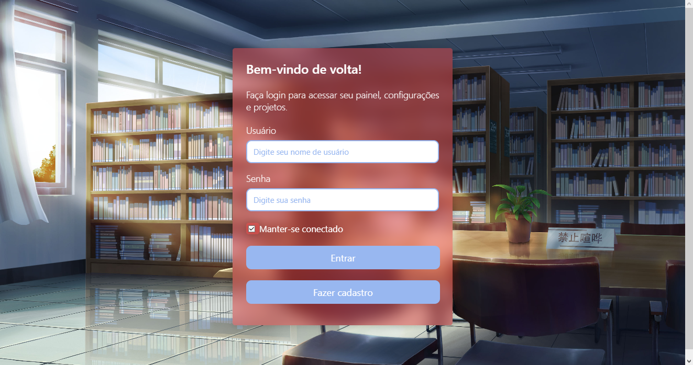

# StudyRoom
## Desenvolvimento de projeto com conceitos de HTML, CSS E JavaScript

📌 Conteúdo
=================
<!--ts-->
   * [Tecnologias](#Tecnologias)
      * [HTML](#html)
      * [CSS](#css)
      * [JavaScript](#javascript)
      
<!--te-->

### Fotos
=================
<h1 align="center">
  
</h1>
<h1 align="center">
  
</h1>

